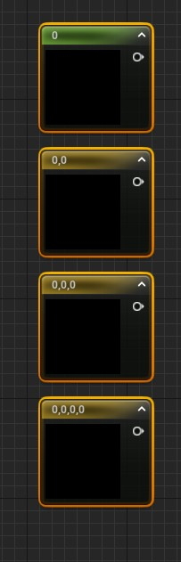

# Project setup handy tools and shortcuts

To setup project lightning
- Window -> Env. Light Mixer

Light direction management
- Ctrl + L (hold), move the mouse to set the preferred direction

Access to content panel
- Ctrl + Space

Add n dimension params in graph editor
- 1 (hold) + left click = 1 dimension
- 2 (hold) + left click = 2 dimensions
- 3 (hold) + left click = 3 dimensions
- 4 (hold) + left click = 4 dimensions

Adjust texture tiling
- Use texture coordinates to adjust UVs

