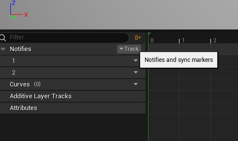

# Audio

## Creating a step SFX

1. Enable the meta sound plugin if not already.
2. Create a MediaSound Source for the step SFX and open it
3. Add a noise node with "White Noise" type and connect to output
4. Add an envelope and multiply with the noise output
5. Create a Square node and add it to the noise output. Adjust the frequency and pulse width.

## Using the SFX in a running animation

1. Open the desired animation
2. Add a new notifier track
3. Add a notifier keyframe to play the sound
4. Set the sound to the desired SFX

