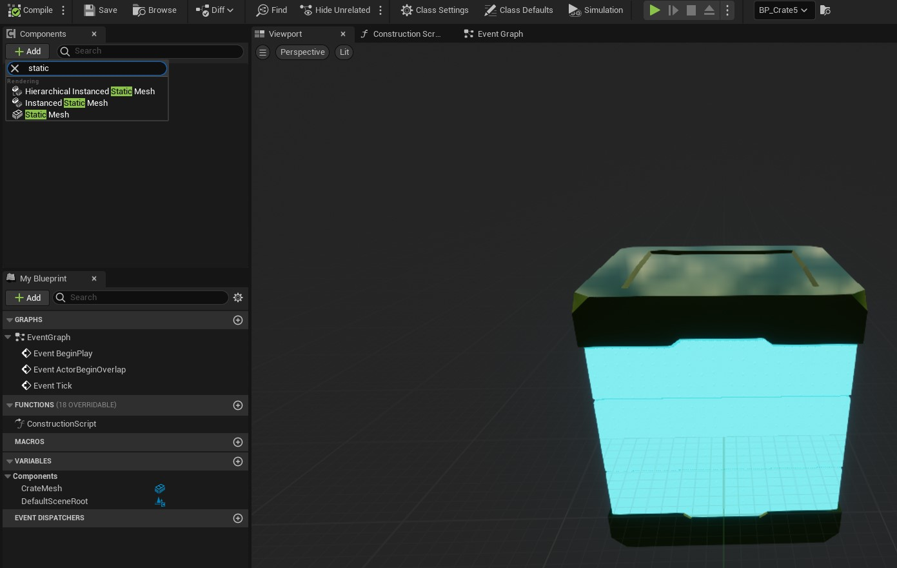
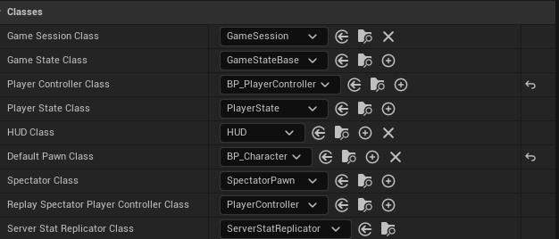
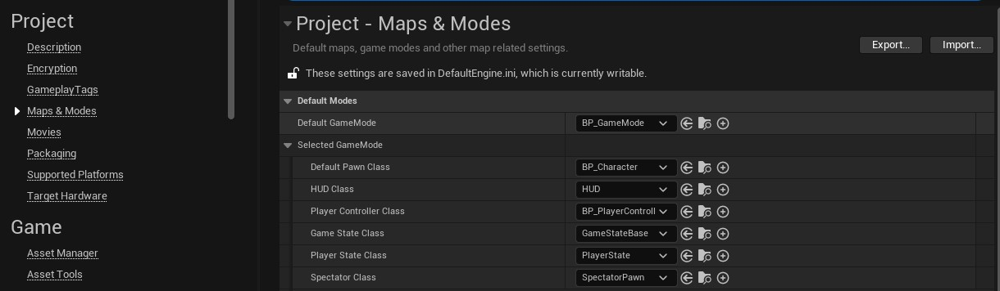
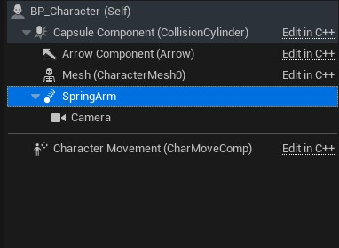
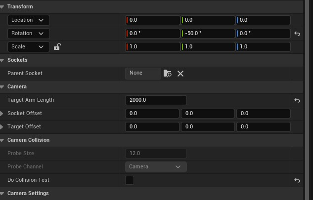
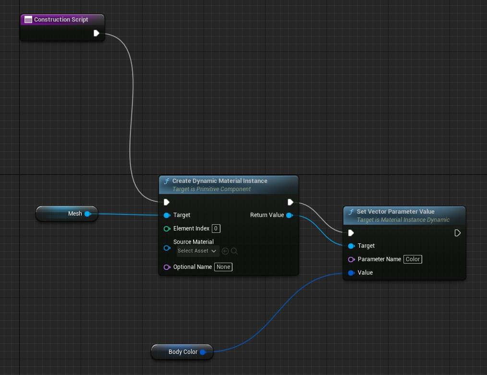
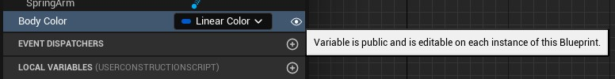
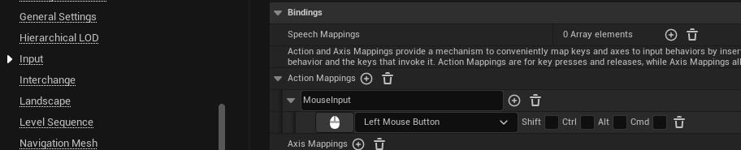
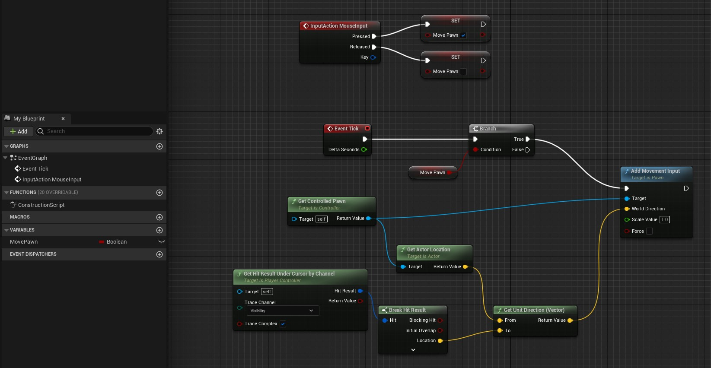

# Blueprints

Static mesh in blueprint 

## Game Mode

Game mode with custom pawn and character controller

In project settings replace game mode with the custom one

## Character

Character with camera:
- Use spring arm to control camera rotation and distance to a target
- Add a camera as a child of the spring arm
- Adjust the spring arm rotation and lenght

### Character modifiable params

In construc script:
- Expose component param as variable
- Set variable visibility to public

## Character controller

Moving character to cursor while mouse down:

- In project settings:
    - Add a left mouse button named binding

- In character controller blueprint:
    - Add a boolean variable to track mouse pressed/released
    - Use named binding to set/unset the boolean variable 
    - Use get controller node pawn to get current location and perform movement
    - Use hit result under cursor by channel to get cursor position
    - Get direction from actor location and cursor locatio
    - Use a branch node to enable the add movement input when the boolean variable is set

