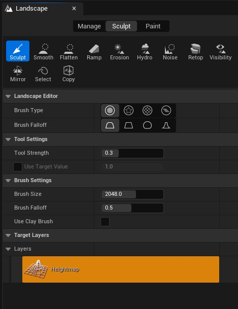
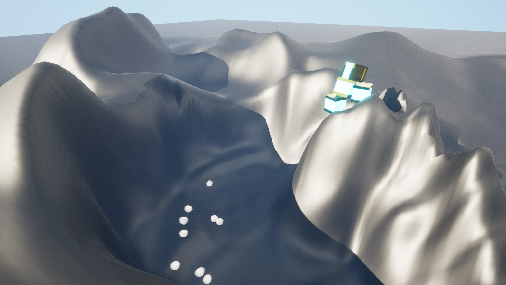
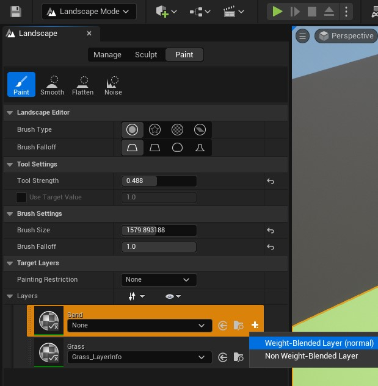
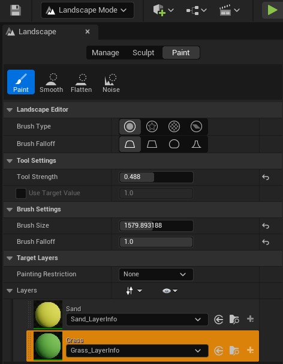
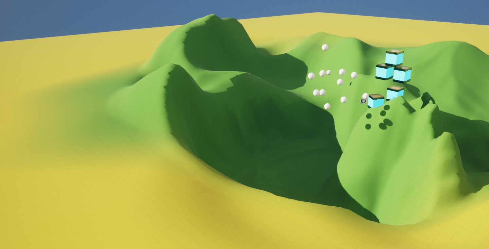

# Landscape

The landscape tools are useful to model terrain

With materials that have blend layers, in the landscape you can paint areas that will apply the textures of the painted layer.

First, is neccesary to create the a layer info per each one.

