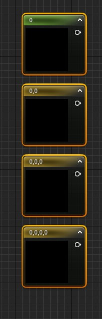
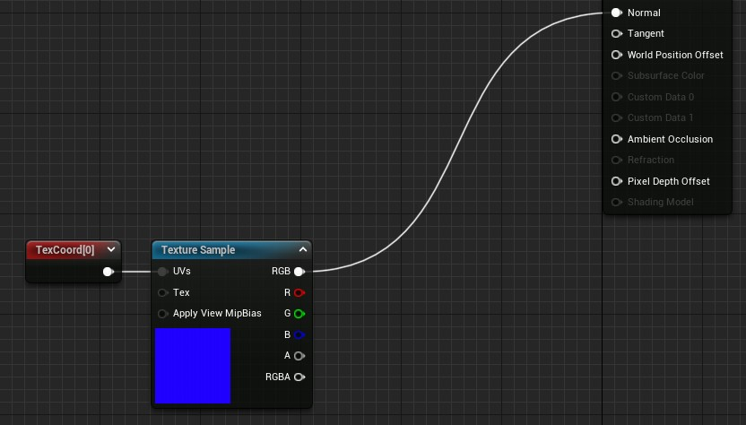
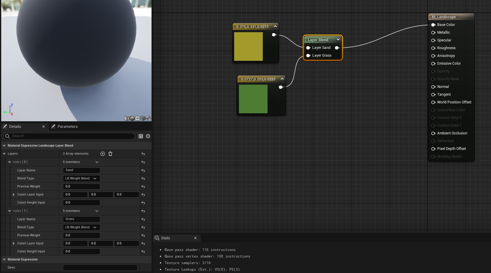
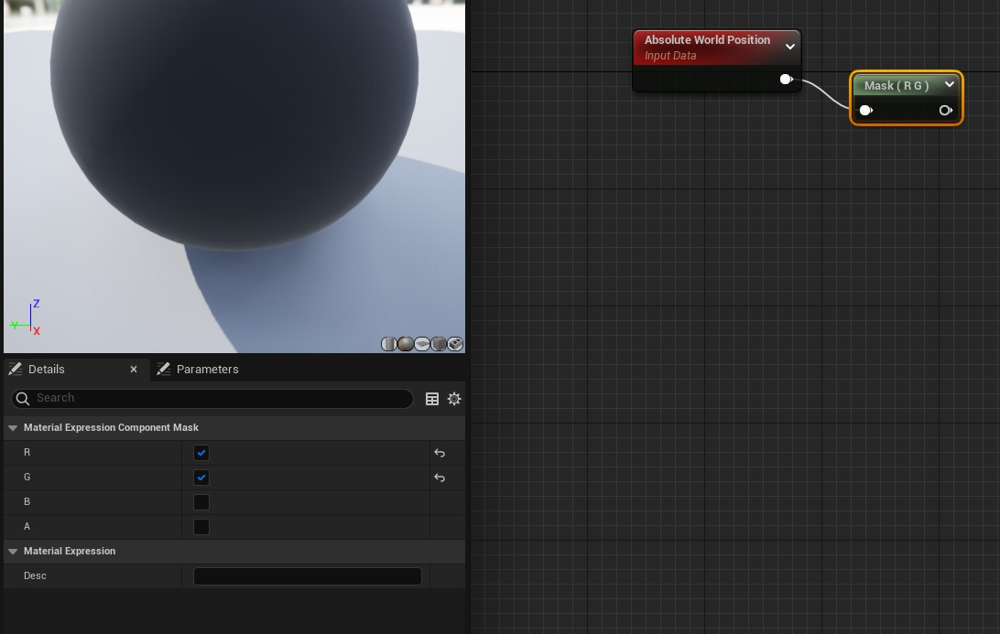
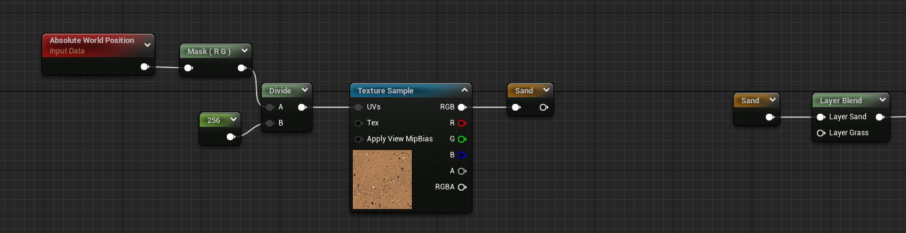
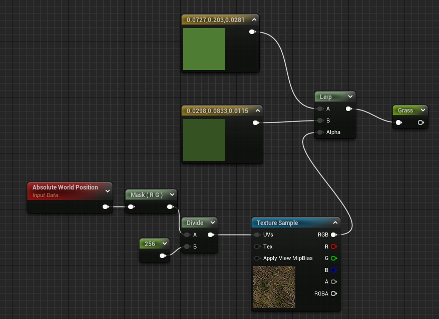

# Materials

Add n dimension params in graph editor
- 1 (hold) + left click = 1 dimension
- 2 (hold) + left click = 2 dimensions
- 3 (hold) + left click = 3 dimensions
- 4 (hold) + left click = 4 dimensions

Adjust texture tiling
- Use texture coordinates to adjust UVs

To remove a connection between node attributes:
- Alt + click on connected attribute in the node

With a Landscape Layer blend node you can apply different colors/textures within the same material.

Material Expression component mask (comp)
- To keep only specific channels on a node

Named re-routes declaration node (named)
- To keep node connections tidy

Lerp node shorcut
- l (hold) + left click

