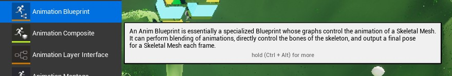
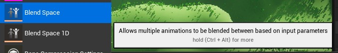
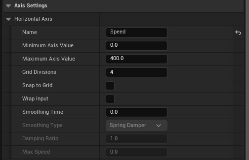
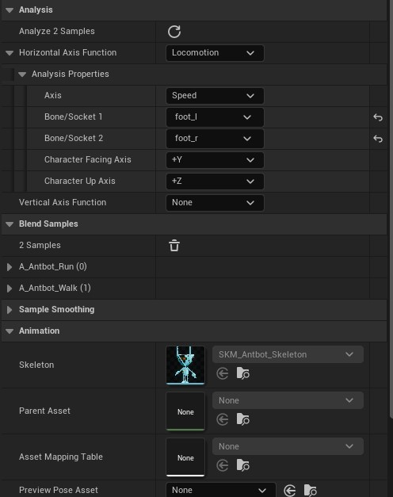
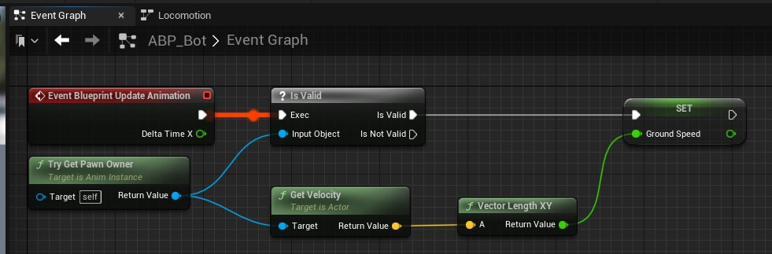
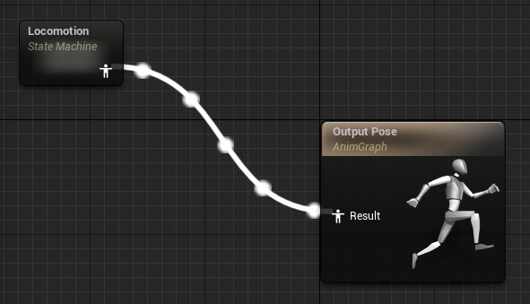
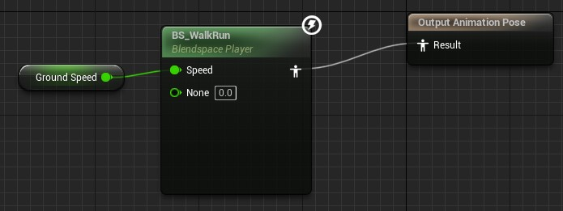
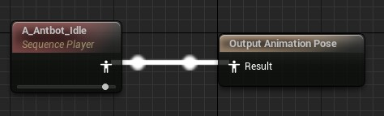
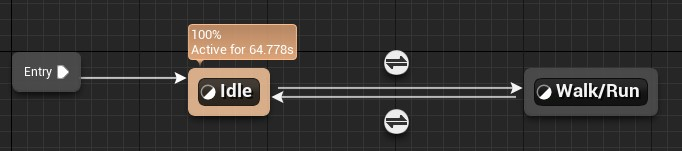
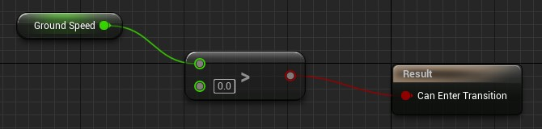

# Animation

Animation blend space
- To transition between two animation sequences based on a specific param

Animation Event Graph
- Retrieve pawn parameters and set variables

Animation Graph State machine
- Transition between animation based on parameters

