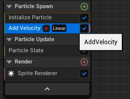
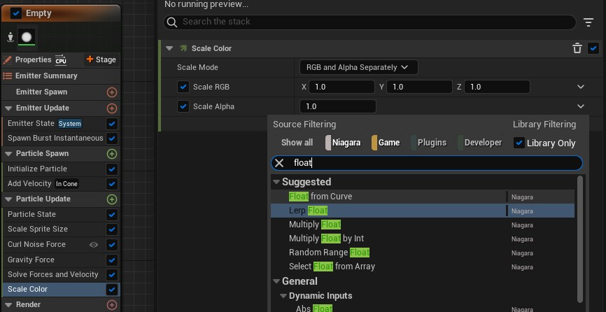

# Niagara

## Creating a steps dust VFX

1. Create a Niagara system
2. In system state set loop behavior to "Once" so it won't loop
3. Add an empty emiter to generate particles
4. In emiter update add a spawn burst instantaneous component
5. In initialize particle, set the desired color, size mode and mass
6. In the particle spawn section, add an "add velocity" component
7. Set the velocity mode to "In Cone"
8. In particle update, add an "Scale sprite size", set the sprite scale to curve and adjust the values.
9. Add a "Curl noise force" component
10. Add a "gravity force" node component and adjust the Z axis to a small positive value.
11. Add a "Scale color" component and set scale alpha to "float from curve", then adjust the curve values.

## Using a Niagara VFX in the running animation

1. Open the running animation
2. In the timeline, add a notify "play niagara particle effect" in the desired key frame
3. In the details of the notifier set the niagara VFX and the socket name to the foot to position the effect.

